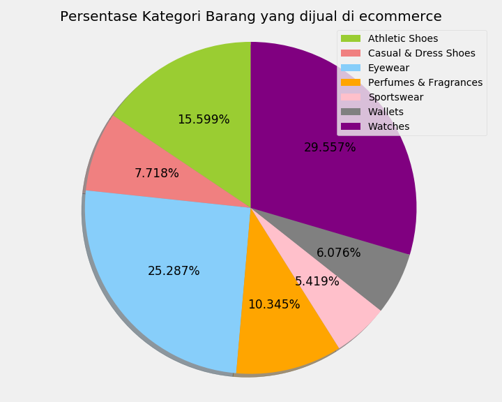
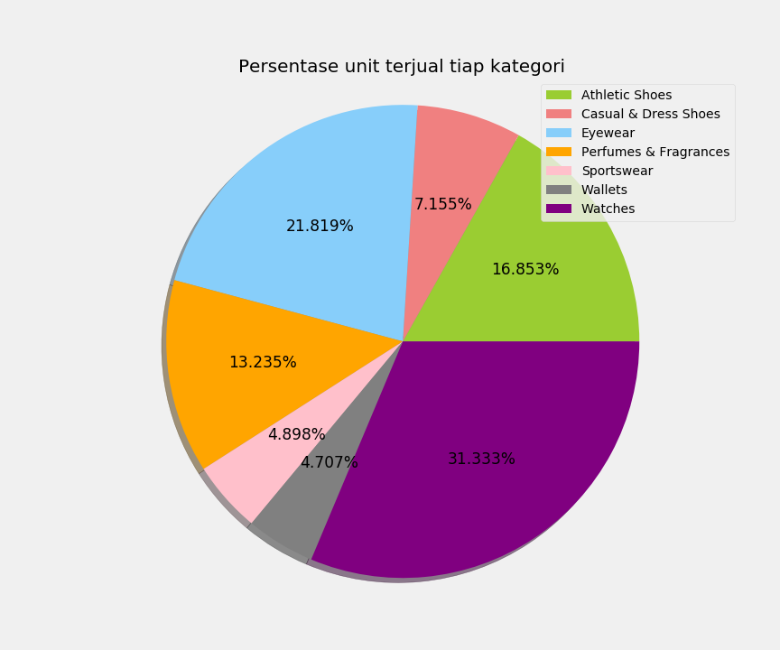

# Tentang Project

Dataset merupakan record penjualan dari suatu e-commerce yang terdiri dari 609 baris dan 9 kolom data. Keterangan kolom-kolom tersebut adalah sbb:

1. category: Kategori lini produk 
2. product: nama brand beserta spesifikasi jenis produk
3. original_price: harga original
4. price: harga
5. perc_of_unit_sold: persentasi unit produk tertentu yang terjual
6. rating: rating produk
7. shopping: keterangan pengiriman barang
8. gender: kategori gender untuk produk

Dari kategori yang ada, dapat diambil gambaran komposisi variasi kategori barang yang dijual di e-commerce, kategori barang apa saja yang menghasilkan penjualan yang baik, dan kategori barang apa yang penjualannya tidak terlalu memuaskan.

# Tujuan
1. Komposisi variasi kategori produk dalam ecommerce
2. Analisa persentase produk terjual terhadap kategorinya
3. Rata-rata rating terhadap variasi kategori barang yang dijual di ecommerce
3. Analisa pola kecenderungan belanja terhadap variasi gender
4. Analisa opsi shipping

# Insights

